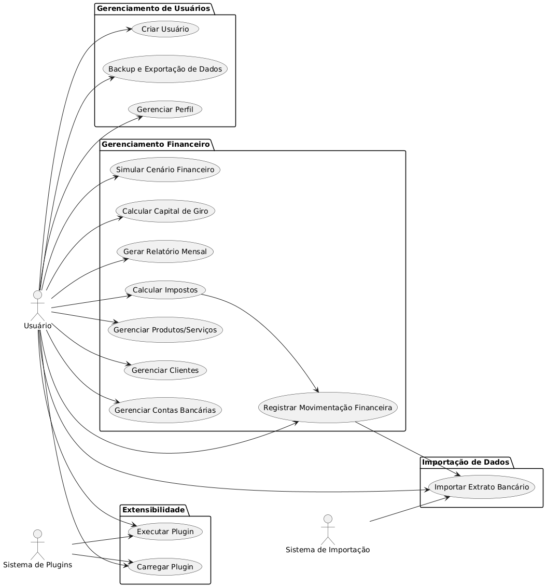

# Myney
Seu controle de caixa, do seu jeito. 

# Índice

- [Apresentação do produto](#apresentação-do-produto)
- [Nome do produto](#nome-do-produto)
- [Resumo das funcionalidades desejadas](#resumo-das-funcionalidades-desejadas)
  - [Lançamentos financeiros](#lançamentos-financeiros)
  - [Relatórios mensais](#relatórios-mensais)
  - [Funcionalidades extras](#funcionalidades-extras)
  - [Simulador de Cenário](#simulador-de-cenário)
  - [Interface](#interface)
  - [Empacotamento para SO 64bits e ARM](#empacotamento-para-so-64bits-e-arm)
- [Tecnologias Escolhidas](#tecnologias-escolhidas)
  - [Linguagem de Programação](#linguagem-de-programação)
  - [Interface de Usuário (UI)](#interface-de-usuário-ui)
  - [Banco de Dados](#banco-de-dados)
  - [Sistema de Plugins](#sistema-de-plugins)
  - [Ferramentas de Build](#ferramentas-de-build)
- [Requisitos Elicitados](#requisitos-elicitados)
  - [Requisitos Funcionais (RF)](#1-requisitos-funcionais-rf)
    - [Criação de Usuário](#11-criação-de-usuário)
    - [Gerenciamento de Contas Bancárias](#12-gerenciamento-de-contas-bancárias)
    - [Lançamento de Movimentações Financeiras](#13-lançamento-de-movimentações-financeiras)
    - [Cadastro de Entidades](#14-cadastro-de-entidades)
    - [Cálculo Automático de Impostos](#15-cálculo-automático-de-impostos)
    - [Relatórios Financeiros Mensais](#16-relatórios-financeiros-mensais)
    - [Simulação de Cenários Financeiros](#17-simulação-de-cenários-financeiros)
    - [Cálculo do Capital de Giro Necessário](#18-cálculo-do-capital-de-giro-necessário)
    - [Suporte a Múltiplas Contas](#19-suporte-a-múltiplas-contas)
    - [Suporte a Plugins](#110-suporte-a-plugins)
  - [Requisitos Não Funcionais (RNF)](#2-requisitos-não-funcionais-rnf)
    - [Operacionalidade](#21-operacionalidade)
    - [Distribuição](#22-distribuição)
    - [Usabilidade](#23-usabilidade)
    - [Desempenho](#24-desempenho)
    - [Segurança](#25-segurança)
    - [Manutenibilidade](#26-manutenibilidade)
    - [Backup e Restauração](#27-backup-e-restauração)
  - [Identificação de Classes, Métodos e Propriedades](#3-identificação-de-classes-métodos-e-propriedades)
    - [Classe: ContaBancaria](#31-classe-contabancaria)
    - [Classe: Movimentacao](#32-classe-movimentacao)
    - [Classe: Cliente](#33-classe-cliente)
    - [Classe: ProdutoServico](#34-classe-produtoservico)
    - [Classe: Imposto](#35-classe-imposto)
    - [Classe: RelatorioMensal](#36-classe-relatoriomensal)
    - [Classe: SimuladorFinanceiro](#37-classe-simuladorfinanceiro)
    - [Classe: Plugin](#38-classe-plugin)
- [Diagrama de Casos de Uso](#diagrama-de-casos-de-uso)
- [Diagrama de Classes](#diagrama-de-classes)
- [MVP](#mvp)
- [Próximos passos](#próximos-passos)

# Apresentação do produto

Quero um programa de gestão de fluxo de caixa, que seja gratuito, offline, fácil e intuitivo de usar. O público alvo são profissionais liberais, pequenas empresas ou qualquer pessoa que queira gerir melhor suas finanças. 

O usuário deve poder informar as entradas e saídas de cada mês, uma de cada vez ou por meio da importação de extratos bancários. Podem ser importados extratos de contas bancárias distintas. O programa deve dar a opção de exibir a movimentação unificada de todas as contas ou o movimento de cada conta bancária, separadamente. O usuário poderá cadastrar clientes, serviços/produtos e o percentual de impostos vinculado a cada serviço/produto. Os impostos devidos deverão ser calculados e aparecer nas despesas do mês em que eles devem ser pagos.

O usuário deve poder criar tipos diferentes de entradas: serviço, venda, resgate de aplicação, rendimento de aplicação, aporte, empréstimo, integralização de capital.

Tipos diferentes de saída: prolabore, lucro/dividendo, despesa fixa, despesa variável, despesa eventual, imposto, taxa, custo fixo, custo variável, custo eventual.

Para cada mês deve ser exibido: o saldo inicial em conta, total do faturamento, lucro líquido, margem de lucro, saldo final em conta.

Gostaria que fosse possível calcular o capital de giro necessário.
Quero poder simular diferentes cenários financeiros.

O programa deve permitir a adição de plugins de integração com sistemas bancários.

Embora atualmente o excel resolva a maior parte desses problemas, a interface é pouco amigável, não é possível a importação de extratos, nem a conciliação de diferentes contas.

Em resumo, um sistema de gestão de fluxo de caixa com foco em simplicidade e clareza, mas ainda assim poderoso, voltado a quem precisa de algo melhor que uma planilha, mas não quer a complexidade (ou o custo) de um ERP. Um software desktop leve, modular e extensível.

## Nome do produto
**Myney** — É curto, sonoro, fácil de lembrar e tem uma vibe moderna. Parece uma mistura de "money" com um toque mais pessoal ou amigável, o que combina bem com a proposta de ser um app simples e intuitivo para gestão financeira.

# Resumo das funcionalidades desejadas

### Lançamentos financeiros

- Entradas e saídas manuais ou via importação de extratos bancários (CSV, OFX, etc).

- Importação de várias contas bancárias com possibilidade de ver o fluxo unificado ou separado por conta.

- Cadastro de clientes, produtos/serviços, com percentual de imposto vinculado.

- Lançamentos automáticos de impostos como despesa no mês de vencimento.

- **Tipos de entradas:**
  
  - Serviço, venda, resgate de aplicação, rendimento de aplicação, aporte, empréstimo, integralização de capital.

- **Tipos de saídas:**
  
  - Prolabore, lucro/dividendo, despesa fixa, variável, eventual, imposto, taxa, custo fixo, variável, eventual.

### Relatórios mensais

- Saldo inicial

- Faturamento

- Lucro líquido

- Margem de lucro

- Saldo final

### Funcionalidades extras

- Cálculo de capital de giro necessário

- Simulações de cenários financeiros

- Sistema de plugins/extensões

- Totalmente offline

- Gratuito e de código aberto, se possível

- Interface fácil e intuitiva

### Simulador de Cenário

- Criar um cenário (ex: "Redução de faturamento em 30% por 3 meses")

- Criar uma cópia do estado atual do caixa e simular alterações de forma segura

- Aplicar ao fluxo futuro

- Ver impacto no lucro, capital de giro, etc. 

### Interface

- Dashboard simples com gráfico de saldo ao longo do tempo.

- Filtros por conta, cliente, produto, tipo de entrada/saída.

- Visão por mês, trimestre, ano.

- Tela de simulação com sliders e inputs.

- Cadastro de categorias e impostos simples.

### Empacotamento para SO 64bits e ARM
 - Windows
 - Linux
 - IOS

## Tecnologias Escolhidas

### Linguagem de Programação
- **C# (.NET 8)**: Escolhida por sua robustez, documentação ampla, suporte multiplataforma e ausência de custos relacionados ao uso de tecnologias de código aberto.

### Interface de Usuário (UI)
- **Avalonia UI**:
  - Multiplataforma (Windows, Linux, macOS).
  - Estilo moderno e open source.
  - Alternativa ao WPF/WinForms, sem dependência exclusiva do Windows.
  - Permite empacotamento fácil como executável (.exe).

### Banco de Dados
- **LiteDB** (ou **SQLite**):
  - Banco de dados local, sem necessidade de servidor.
  - Leve e adequado para aplicações desktop.

### Sistema de Plugins
- Implementação utilizando:
  - **Reflection + MEF (Managed Extensibility Framework)**.
  - Ou sistema de diretórios com `Assembly.LoadFrom(...)`.

### Ferramentas de Build
- **Visual Studio Community**: IDE gratuita e poderosa para desenvolvimento em C#.
- **MSIX** ou empacotador do Avalonia: Para gerar instaladores executáveis (.exe) de forma simples e eficiente.

# Requisitos Elicitados

## 1. Requisitos Funcionais (RF)

### 1.1 Criação de Usuário
- Cada usuário terá um ambiente separado e suas próprias contas para gerenciar.
- As contas de usuários não dialogam entre si.
- Cada usuário pode fazer backup, importar e exportar os arquivos do seu perfil com suas contas para utilizar em outro dispositivo ou armazenar na nuvem.
- O usuário terá um nome e poderá ter uma senha, se desejar.
- O usuário pode excluir o seu proprio perfil.

### 1.2 Gerenciamento de Contas Bancárias
- Cadastrar contas bancárias.
- Editar ou excluir contas bancárias.
- Visualizar movimentações por conta ou de forma unificada.

### 1.3 Lançamento de Movimentações Financeiras
- Cadastrar entrada manualmente.
- Cadastrar saída manualmente.
- Importar extrato bancário (CSV, OFX, outros formatos).
- Categorizar tipo de entrada e tipo de saída.
- Associar lançamento a uma conta bancária.
- Associar lançamento a um cliente e a um produto/serviço (opcional).

### 1.4 Cadastro de Entidades
- Cadastrar clientes.
- Cadastrar produtos/serviços com percentual de imposto vinculado.

### 1.5 Cálculo Automático de Impostos
- Calcular o valor do imposto baseado no produto/serviço.
- Lançar a despesa com imposto no mês correspondente.

### 1.6 Relatórios Financeiros Mensais
- Exibir saldo inicial.
- Exibir total de entradas (faturamento).
- Exibir total de saídas.
- Exibir lucro líquido.
- Exibir margem de lucro.
- Exibir saldo final.

### 1.7 Simulação de Cenários Financeiros
- Alterar parâmetros como faturamento, custos e impostos.
- Visualizar impacto financeiro nos meses seguintes.

### 1.8 Cálculo do Capital de Giro Necessário
- Calcular com base em despesas fixas e ciclo financeiro do negócio.

### 1.9 Suporte a Múltiplas Contas
- Importar e exibir movimentações separadas por conta.
- Exibir movimentações de forma unificada.

### 1.10 Suporte a Plugins
- Sistema modular que permita carregamento de funcionalidades extras via plugins.

## 2. Requisitos Não Funcionais (RNF)

### 2.1 Operacionalidade
- O sistema deve funcionar totalmente offline.
- A aplicação deve rodar em máquinas Windows 10 ou superior, 64 bits.

### 2.2 Distribuição
- O sistema deve ser gratuito e distribuído como instalador para Windows (.exe).

### 2.3 Usabilidade
- A interface deve ser intuitiva, responsiva e clara, evitando sobrecarga visual.

### 2.4 Desempenho
- O tempo de resposta da aplicação deve ser inferior a 2 segundos para qualquer ação.

### 2.5 Segurança
- A segurança local deve impedir corrupção acidental dos dados (uso de banco transacional).

### 2.6 Manutenibilidade
- O código deve ser escrito de forma modular, visando manutenibilidade e extensibilidade.

### 2.7 Backup e Restauração
- O sistema deve permitir backup e restauração dos dados.

## 3. Identificação de Classes, Métodos e Propriedades

### 3.1 Classe: ContaBancaria
- **Propriedades:** Id, Nome, Banco, Agencia, Numero, SaldoInicial.
- **Métodos:** AdicionarMovimentacao(Movimentacao), CalcularSaldoFinal().

### 3.2 Classe: Movimentacao
- **Propriedades:** Id, Data, Descricao, Valor, Tipo, Subtipo, ContaBancariaId, ClienteId?, ProdutoServicoId?.
- **Métodos:** ClassificarTipo().

### 3.3 Classe: Cliente
- **Propriedades:** Id, Nome, Documento, Contato.
- **Métodos:** AtualizarCadastro().

### 3.4 Classe: ProdutoServico
- **Propriedades:** Id, Nome, Tipo, PercentualImposto.
- **Métodos:** CalcularImposto(valorBase).

### 3.5 Classe: Imposto
- **Propriedades:** Id, Nome, Percentual, Vencimento.
- **Métodos:** GerarDespesa(valorBase, dataBase).

### 3.6 Classe: RelatorioMensal
- **Propriedades:** Mes, Ano, SaldoInicial, TotalEntradas, TotalSaidas, LucroLiquido, MargemLucro, SaldoFinal.
- **Métodos:** Gerar(contas: List<ContaBancaria>).

### 3.7 Classe: SimuladorFinanceiro
- **Propriedades:** Cenario, ParametrosAlterados.
- **Métodos:** AplicarCenario(), GerarProjecao().

### 3.8 Classe: Plugin
- **Propriedades:** Nome, Versao, Autor.
- **Métodos:** Carregar(), Executar().

# Diagrama de Casos de Uso

# Diagrama de Classes

## MVP

1. Criar versão de console para testar a lógica do distema
2. Criar design da "interface final" 
3. Criar versão com a "interface final"

## Próximos passos

1. Criar a estrutura inicial do projeto em C# com Avalonia
2. Fazer um primeiro módulo: cadastro de contas + lançamentos manuais
3. Criar o esqueleto do sistema de plugins
4. Montar estrutura de dados (LiteDB ou SQLite)
5. Configurar o projeto para gerar .exe instalável